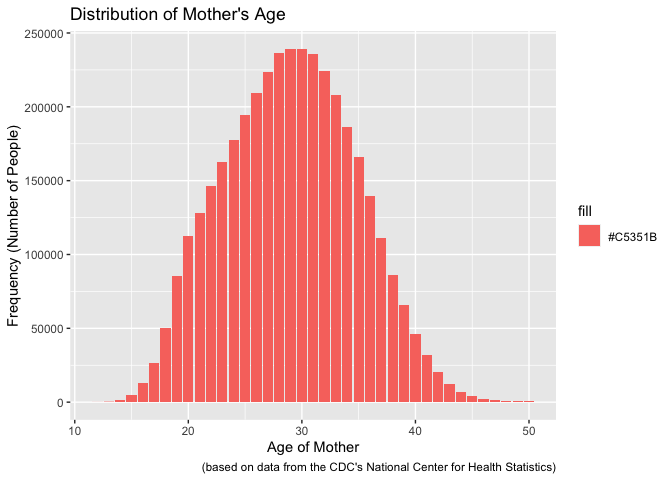
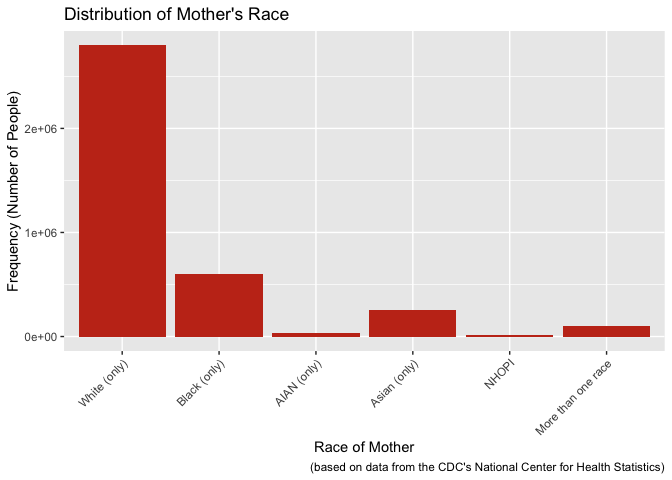
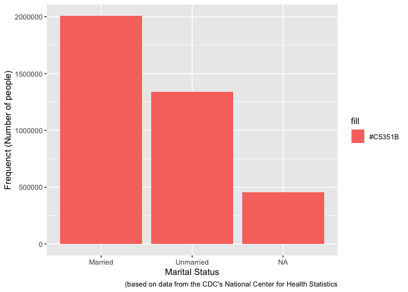
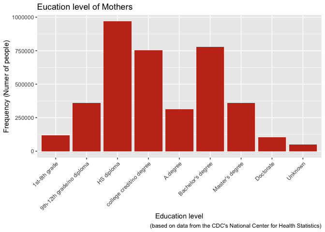
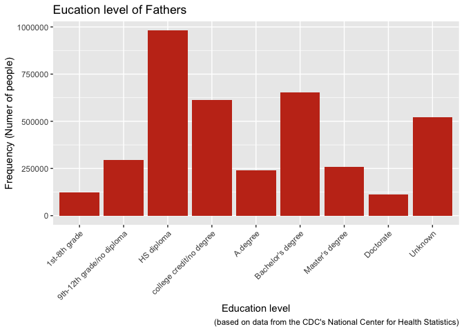
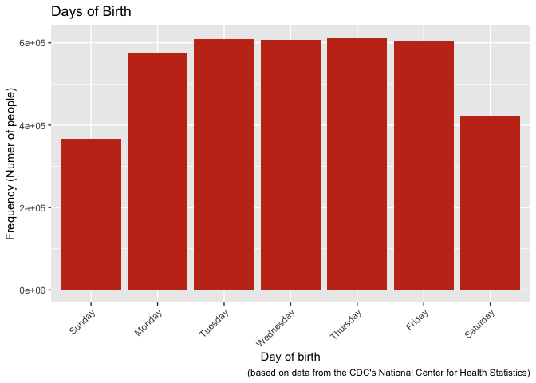
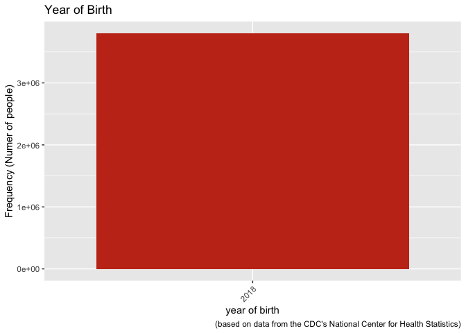
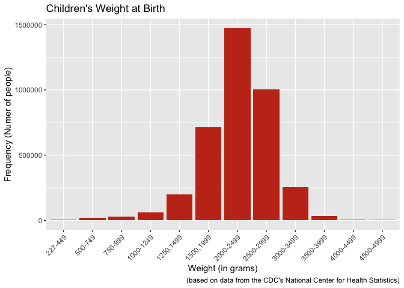

Investigation of Different Causes of Infant Mortality in the United
States
================
Jonathan Kanyinda
03/13/2021

## Abstract

Infant mortality in the United States is one of the less discussed
topics in general. However, it affects a lot of families and communities
in the country. In this report, infant mortality based on the data from
the year 2018 by age, maternal race, gestational age and maternal state
of residence have been investigated. Descriptive tabulations as well as
graphs are reported and interpreted for infant death mortality using the
2018 period linked birth/infant datafile that is based on birth and
death certificates registered in all states and the district of
Columbia. More than 20,000 infant deaths were reported in 2018. The
infant mortality rate declined by 4 % in comparison to 2017, and
regardless of the differences investigated, in general the mortality
rate has been trending down since 1995. I will do an exploratory
analysis to investigate the relation between race, gestational age and
state of residence with infant mortality

## Introduction

## Methods

### Data Acquisition

In this analysis the data was obtained from public data files of the
Center for Desease Control and Prevention’s National Center for Health
Statistic at
:<https://www.cdc.gov/nchs/data_access/vitalstatsonline.htm#Period_Linked>
(Data Access - Vital Statistics Online 2020) and the selected data was
from the 2017/2018 year as a Zipped file that was decompressed/expanded
into the computer and there was a user guide provided that was used to
collect the information of interrest(NCHS 2020). The first step was to
obtain the files that were ziped in order to be able to explore them.
After obtaining the file, the information was encoded as a “fixed width
function” file and therefore I used the fwf function from the readr
package (Wickham and Hester 2020). Next, the user guide helped to figure
out which set rows contained specific information in order to be able to
retrieve that information using the fwf function in R.

### Data Preparation

For the data analysis I used RStudio version 1.2.5033 (R Core Team 2020)
and R version 4.0.3 (R Core Team 2020) for wrangling and data analysis.
The data obtained was a set of numbers displayed in a table (table1) and
the user guide provided the correspondence and significance of each
number. Therefore to better understand the data, I created a word
document in which I recorded the meaning of each number in the different
categories of interest using the user guide as a reference and then
proceeded to modify the values displayed in the inintial table (table1)
using the as\_factor function from the forcats package (Wickham 2020)
function combined with the combine function (c()) from the base package
(R Core Team 2020) and then proceeded to print a new table
(main\_table).

## Results

Table 1

    ## # A tibble: 3,801,534 x 10
    ##     year month   day   age  race place mstatus meduc feduc weight
    ##    <dbl> <chr> <dbl> <dbl> <dbl> <dbl>   <dbl> <dbl> <dbl> <chr> 
    ##  1  2018 01        2    30     1     1       1     6     3 08    
    ##  2  2018 01        2    35     3     1       2     9     4 07    
    ##  3  2018 01        2    28     1     1       1     6     4 07    
    ##  4  2018 01        2    23     3     1       2     2     2 07    
    ##  5  2018 01        3    37     1     1       1     4     3 05    
    ##  6  2018 01        2    26     1     2       1     6     6 09    
    ##  7  2018 01        3    28     1     1       1     4     6 07    
    ##  8  2018 01        4    31     1     1       1     3     7 07    
    ##  9  2018 01        5    37     1     1       1     2     4 08    
    ## 10  2018 01        6    26     1     1       1     7     6 07    
    ## # … with 3,801,524 more rows

    ## [1] Sunday    Monday    Tuesday   Wednesday Thursday  Friday    Saturday 
    ## Levels: Sunday Monday Tuesday Wednesday Thursday Friday Saturday

    ## [1] White (only)       Black (only)       AIAN (only)        Asian (only)      
    ## [5] NHOPI              More than one race
    ## 6 Levels: White (only) Black (only) AIAN (only) Asian (only) ... More than one race

    ## [1] Married   Unmarried
    ## Levels: Married Unmarried

    ## [1] Hospital                   Free standing birth center
    ## [3] Home (intended)            Home,unintended0          
    ## [5] Home (unknown)             clinic/doctor's office    
    ## [7] Other                      Unknown                   
    ## 8 Levels: Hospital Free standing birth center ... Unknown

    ## [1] 1st-8th grade             9th-12th grade/no diploma
    ## [3] HS diploma                college credit/no degree 
    ## [5] A.degree                  Bachelor's degree        
    ## [7] Master's degree           Doctorate                
    ## [9] Unknown                  
    ## 9 Levels: 1st-8th grade 9th-12th grade/no diploma ... Unknown

    ##  [1] January   February  March     April     May       June      July     
    ##  [8] August    September October   November  December 
    ## 12 Levels: January February March April May June July August ... December

    ##  [1] 227-449    500-749    750-999    1000-1249  1250,1499  1500,1999 
    ##  [7] 2000-2499  2500-2999  3000-3499  3500-3999  4000-4499  4500-4999 
    ## [13] 5000-8167  Not Stated
    ## 14 Levels: 227-449 500-749 750-999 1000-1249 1250,1499 1500,1999 ... Not Stated

    ## # A tibble: 3,801,534 x 10
    ##     year month  day      age race    place     mstatus  meduc    feduc    weight
    ##    <int> <fct>  <fct>  <dbl> <fct>   <fct>     <fct>    <fct>    <fct>    <fct> 
    ##  1  2018 Janua… Monday    30 White … Hospital  Married  Bachelo… HS dipl… 2500-…
    ##  2  2018 Janua… Monday    35 AIAN (… Hospital  Unmarri… Unknown  college… 2000-…
    ##  3  2018 Janua… Monday    28 White … Hospital  Married  Bachelo… college… 2000-…
    ##  4  2018 Janua… Monday    23 AIAN (… Hospital  Unmarri… 9th-12t… 9th-12t… 2000-…
    ##  5  2018 Janua… Tuesd…    37 White … Hospital  Married  college… HS dipl… 1250,…
    ##  6  2018 Janua… Monday    26 White … Free sta… Married  Bachelo… Bachelo… 3000-…
    ##  7  2018 Janua… Tuesd…    28 White … Hospital  Married  college… Bachelo… 2000-…
    ##  8  2018 Janua… Wedne…    31 White … Hospital  Married  HS dipl… Master'… 2000-…
    ##  9  2018 Janua… Thurs…    37 White … Hospital  Married  9th-12t… college… 2500-…
    ## 10  2018 Janua… Friday    26 White … Hospital  Married  Master'… Bachelo… 2000-…
    ## # … with 3,801,524 more rows

<!-- --><!-- --><!-- --><!-- --><!-- --><!-- --><!-- --><!-- --><!-- --><!-- -->

## Discussion

## Litterature Cited

1.  National Center for Health Statistics. User guide to the 2018
    period/2017 cohort linked birth/infant death public use file. 2020.
    Available from:
    <ftp://ftp.cdc.gov/pub/Health_Statistics/NCHS/Dataset_Documentation/DVS/period-cohort-linked/18PE17CO_linkedUG.pdf>.

2.  Data Access - Vital Statistics Online. National Center for Health
    Statistics, 2020,
    www.cdc.gov/nchs/data\_access/vitalstatsonline.htm\#Period\_Linked.

3.  Hadley Wickham and Jim Hester (2020). readr: Read Rectangular Text
    Data. R package version 1.4.0.
    <https://CRAN.R-project.org/package=readr>

4.  Hadley Wickham (2020). forcats: Tools for Working with Categorical
    Variables (Factors). R package version 0.5.0.
    <https://CRAN.R-project.org/package=forcats>

5.  R Core Team (2020). R: A language and environment for statistical
    computing. R Foundation for Statistical Computing, Vienna, Austria.
    URL <https://www.R-project.org/>.

6.  H. Wickham. ggplot2: Elegant Graphics for Data Analysis.
    Springer-Verlag New York, 2016.
