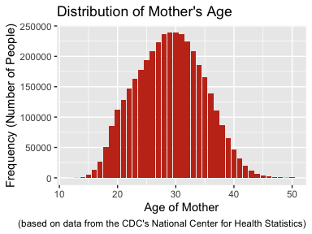
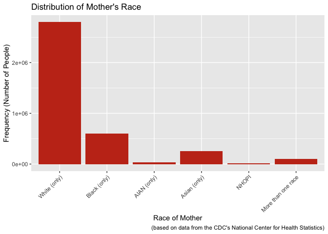
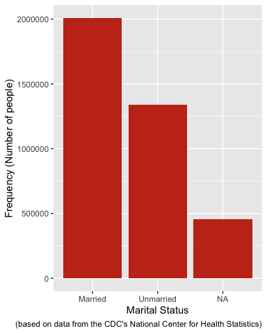
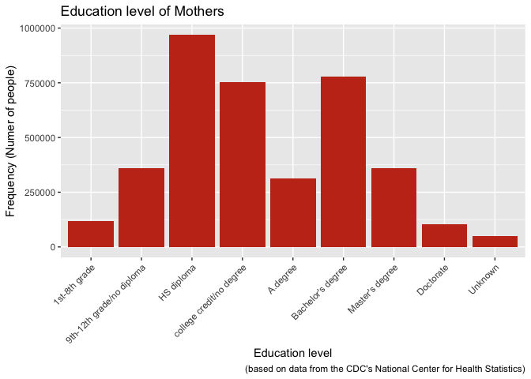
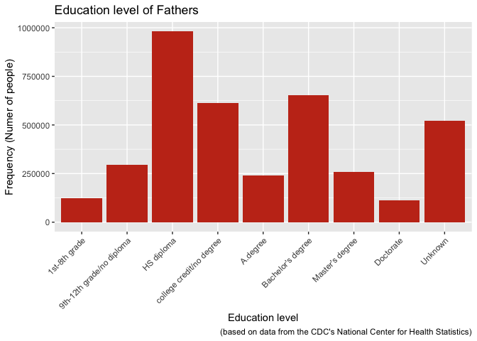
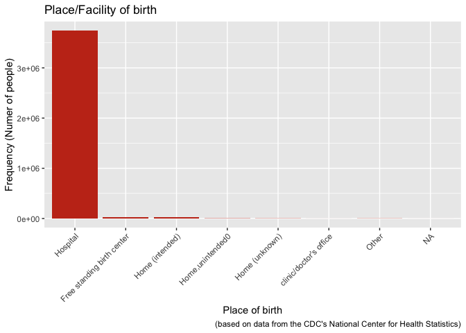
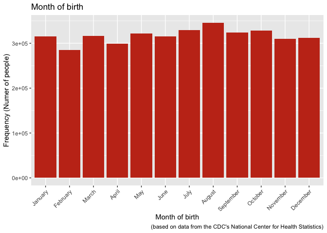
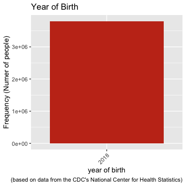
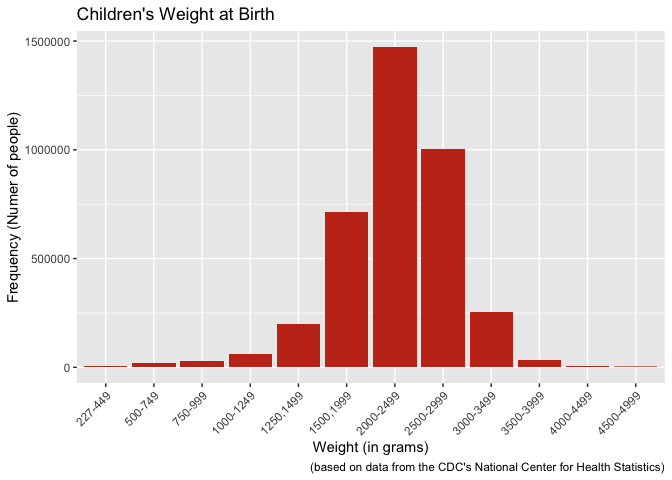

# Investigation of Different Causes of Infant Mortality in the United States

Jonathan Kanyinda and Christopher Merkord

Biosciences Department, Minnesota State University Moorhead, 1104 7th
Avenue South, Moorhead, MN 56563 USA

## Abstract

Infant mortality in the United States is one of the less discussed
topics in general. However, it affects a lot of families and communities
in the country. In this report, infant mortality based on the data from
the year 2018 by age, maternal race, gestational age and maternal state
of residence have been investigated. Descriptive tabulations as well as
graphs are reported and interpreted for infant death mortality using the
2018 period linked birth/infant datafile that is based on birth and
death certificates registered in all states and the district of
Columbia. More than 20,000 infant deaths were reported in 2018. The
infant mortality rate declined by 4 % in comparison to 2017, and
regardless of the differences investigated, in general the mortality
rate has been trending down since 1995. I will do an exploratory
analysis to investigate the relation between race, gestational age and
state of residence with infant mortality

## Introduction

Infant mortality is the death of children under the age of one year.
This topic is often overlooked because it is believed that women get
pregnant, give birth, children grow to become men and women. However,
this is not always the case, there are multiple cases of infant deaths
recored in the United States and reported to the Center for Disease
Control and prevention’s National Center for Health Statistics and made
available online (Data Access - Vital Statistics Online 2020), where
over 3 million cases have been reported for the United States alone in
the year. I believe that getting more understanding on the different
causes of infant death is the first step in preventing it as it will
provide us with specific areas to explore and improve. Prevention can
only be applied when there is knowledge of the risks and causes and one
way to ensure a good prevention in any area is by educating people on
the specific and or various subjects. Education tends to be overlooked
when it comes to some situation, but even the general knowledge on a
topic is better than the absence of any knowledge. By investigating the
different outcomes and education levels, not only helps in avoiding
assumptions, but it mainly provides valuable information about the ratio
between the different education levels and therefore provide a starting
point for improvement of both the education system and the provision of
ways to keep children in schools as well as for the other various
probable causes. This report presents infant mortality statistics based
on the data from the 2018 period linked birth/infant death file. Infant
mortality is described by maternal race, maternal age, marital status,
education level, month, day and place of birth. This study has been made
using collected data in the year 2018 of children under the age of 1 who
had died. (Data Access - Vital Statistics Online 2020). This was done in
the goal to further investigate the various causes of infant death.

## Methods

### Data Acquisition

In this analysis the data was obtained from public data files of the
Center for Desease Control and Prevention’s National Center for Health
Statistic at
:<https://www.cdc.gov/nchs/data_access/vitalstatsonline.htm#Period_Linked>
(Data Access - Vital Statistics Online 2020) and the selected data was
from the 2017/2018 year as a Zipped file that was decompressed/expanded
into the computer and there was a user guide provided that was used to
collect the information of interrest(NCHS 2020). The first step was to
obtain the files that were ziped in order to be able to explore them.
After obtaining the file, the information was encoded as a “fixed width
function” file and therefore I used the fwf function from the readr
package (Wickham and Hester 2020). Next, the user guide helped to figure
out which set rows contained specific information in order to be able to
retrieve that information using the fwf function in R.

### Data Preparation

For the data analysis I used RStudio version 1.2.5033 (R Core Team 2020)
and R version 4.0.3 (R Core Team 2020) for wrangling and data analysis.
The data obtained was a set of numbers displayed in a table (table1) and
the user guide provided the correspondence and significance of each
number. Therefore to better understand the data, I created a word
document in which I recorded the meaning of each number in the different
categories of interest using the user guide as a reference and then
proceeded to modify the values displayed in the inintial table (table1)
using the as\_factor function from the forcats package (Wickham 2020)
function combined with the combine function (c()) from the base package
(R Core Team 2020) and then proceeded to print a new table
(main\_table).

## Results

Table 1

<!-- -->

*Figure 1. Infant Mortality recorded by maternal age: United States
2017-2018*

<!-- -->

*Figure 2. Infant mortality recorded by maternal race: United States
2017-2018*

<!-- -->

*Figure 3. Infant mortality recorded by marital Status: united States
2017-2018*

<!-- -->

*Figure 4. Infant mortality recorded by education level of mothers:
United States 2017-2018*

<!-- -->

*Figure 5. Infant mortality recorded by education level of fathers:
United States 2017-2018*

<!-- -->

*Figure 6. Infant mortality recorded by place of birth: United States
2017-2018*

*Figure 7. Infant mortality recorded by days of birth: United States
2017-2018*

<!-- -->

*Figure 8. infant mortality recorded by days of birth: United States
2017-2018*

<!-- -->

*Figure 9. Infant mortality recorded by year of birth: United States
2017-2018*

<!-- -->

*Figure 10. infant mortality recorded by weight of children at birth:
United States 2017-2018*

## Discussion

This data is reliable as it was collected based on informations provided
on birth certificates and makes it possible to study the causes of death
in different regions, populations, races and even the different social
statuses of people. In this Exploratory data analysis, the data provides
a correlation between certain social and biological states based on the
linked birth/infant mortality from the year 2018 published by the CDC’s
NHS. Based on the different aspects investigated, there had been more
cases in the most prevalent groups of individuals (e.g., whites (only))
this is because of the ratio in comparison to the other races (Figure
2). The average age of mothers giving birth is mostly common across the
entire population (Figure 1) and thus there is a higher record number of
infant deaths in that age range. And most birth have been given in
hospitals (Figure 6) implying the assistance of a trained personnel and
also most of the recorded birth were given by married people (Figure 3)
with babies of an average weigh of around 2000-2500 grams (Figure 10).
There is a consistent pattern in the days of birth (Figure 7) and Month
of birth (Figure 8) From the education level perspective, it is
noticeable that most infant deaths occurred in parents with lower
education levels (Figure 5). The level of education is usually
indicative of the lifestyle and the lower education levels usually
result in less stable living situations and these could have negative
effects on the pregnancies leading to infant death and justifying the
lower infant death rate in hypothetically more stable lifestyles of more
educated people. Out of all the trends observed, the most obvious is the
education level as that can be related to the lifestyle and thus explain
the not always adequate condition for pregnancy care, either financially
and or having the knowledge of dispositions to take to ensure a good
pregnancy period.Therefore after investigating the exact ways in which
education and other factors play a role, the next steps could be to
develop ways to provide the general public with needed/required
information and provide them with knowledge and access to the different
resources available to them.

## Litterature Cited

1.  National Center for Health Statistics. User guide to the 2018
    period/2017 cohort linked birth/infant death public use file. 2020.
    Available from:
    <ftp://ftp.cdc.gov/pub/Health_Statistics/NCHS/Dataset_Documentation/DVS/period-cohort-linked/18PE17CO_linkedUG.pdf>.

2.  Data Access - Vital Statistics Online. National Center for Health
    Statistics, 2020,
    www.cdc.gov/nchs/data\_access/vitalstatsonline.htm\#Period\_Linked.

3.  Hadley Wickham and Jim Hester (2020). readr: Read Rectangular Text
    Data. R package version 1.4.0.
    <https://CRAN.R-project.org/package=readr>

4.  Hadley Wickham (2020). forcats: Tools for Working with Categorical
    Variables (Factors). R package version 0.5.0.
    <https://CRAN.R-project.org/package=forcats>

5.  R Core Team (2020). R: A language and environment for statistical
    computing. R Foundation for Statistical Computing, Vienna, Austria.
    URL <https://www.R-project.org/>.

6.  H. Wickham. ggplot2: Elegant Graphics for Data Analysis.
    Springer-Verlag New York, 2016.
